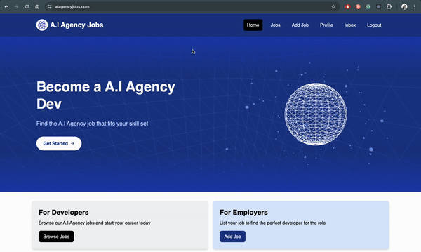

# A.I Agency Jobs
The application is a full-stack job platform specifically focused on AI agency recruitment. It uses Express.js for the backend (server.js) and React for the frontend, with MongoDB as the database.

Key Features:

* Authentication: Implements Google OAuth for secure user authentication.
* Job Management: Employers can post, edit, and delete job listings. Job seekers can view and apply to positions.
* Application System: Users can submit applications with: Cover message, Skills, Project links, CV upload (PDF only), Contact information.

Employers can:

* View received applications.
* Accept/reject applications.
* Delete rejected applications.

Applicants can:

* View their sent applications.
* Withdraw applications.
* Track application status.

Technical Implementation:

* File Storage: Uses AWS S3 for CV storage and document management.

Security:

* Implements authentication middleware.
* Secure file handling.
* Private document access control.

Data Models: 

* Structured schemas for Users, Jobs, and Applications.

User Experience:

* Responsive design for both desktop and mobile
* Real-time status updates
* Secure document viewing system
* Comprehensive inbox system for managing applications

## Lessons Learned:

The development of A.I Agency Jobs provided invaluable insights into building a full-stack application with real-world authentication and file handling requirements. A key learning was the importance of secure file management, implemented through AWS S3 with private access controls (server/server.js, lines 63-115). The project highlighted the complexity of handling user sessions and authentication flows, where implementing Google OAuth proved more nuanced than initially anticipated. Working with MongoDB aggregation pipelines for tracking application statuses (server/server.js, lines 441-475) demonstrated the power of database-level operations for complex queries. Error handling emerged as crucial, particularly in file upload scenarios and application status management, leading to the implementation of comprehensive error tracking and user feedback systems. The project also emphasized the importance of proper state management and real-time updates, especially in the application tracking system (src/components/ApplicationForm.jsx, lines 29-77). Perhaps the most significant takeaway was the importance of security in handling sensitive user data, reflected in the detailed privacy policy implementation and secure document access controls. This experience reinforced that building a production-ready application requires careful consideration of user experience, security, and scalability from the ground up.
 
## Possible Additions:

Real-time Notifications

* Implement WebSocket connections for instant updates on application status changes
* Notify employers when new applications arrive

Advanced Search & Filtering

* Add AI-powered job matching based on applicant skills
* Implement advanced filtering for salary ranges, remote work, and experience levels

Messaging System

* Add direct messaging between employers and applicants after application acceptance
* Include message templates for common responses

## Notes: 

Have to enable third-party cookies to sign up as the application uses Google Oauth.

]
